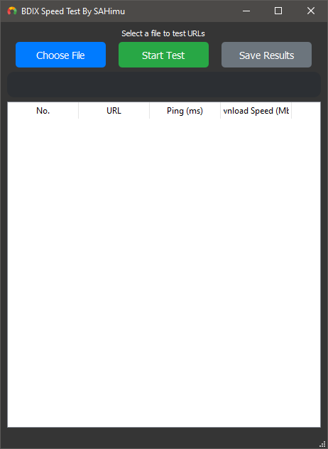

# bdix_website_test
![version-badge] ![workflow-badge] ![license-badge]

*bdix_website_test* is a magnificent app devlop by Ai and SAHimu

## Contents

1. [Requirements](#requirements)
2. [Installations](#installation)
3. [Updating](#updating)
4. [How it works](#how-it-works)
5. [Developing](#developing)
6. [License](#license-mit)
7. [websites](website)

## Requirements
- python (3.5+)
- pip
- google sheet or microsoft office excel

## installation
- no installation requires

## updating
- ui update

## how-it-works
test all website then give you ping and download speed. you can save the test result on .xlsx file. from file or on the app you can filter best download speed website and open it on browser.

## Developing
app fully devlop by ai and SAHimu

## License MIT
Project License can be found [here](LICENSE.md).

## website
more then 746 website added.

[version-badge]:   https://img.shields.io/badge/Version-v_0.3-blue  
[workflow-badge]:  https://img.shields.io/badge/Test-pass-green
[license-badge]:   https://img.shields.io/badge/license-MIT-007EC7.svg

