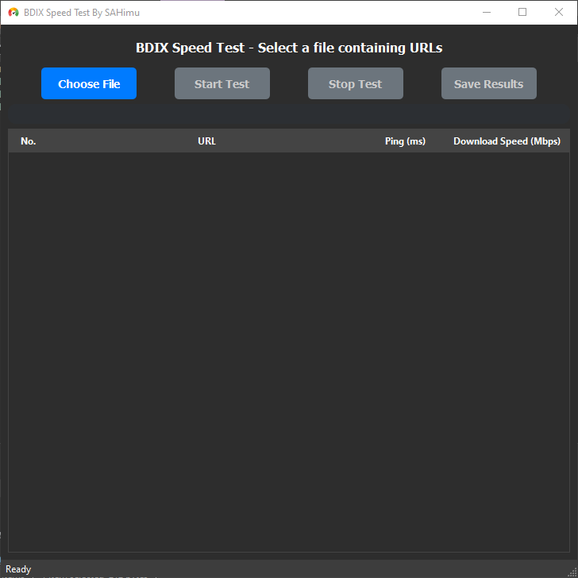
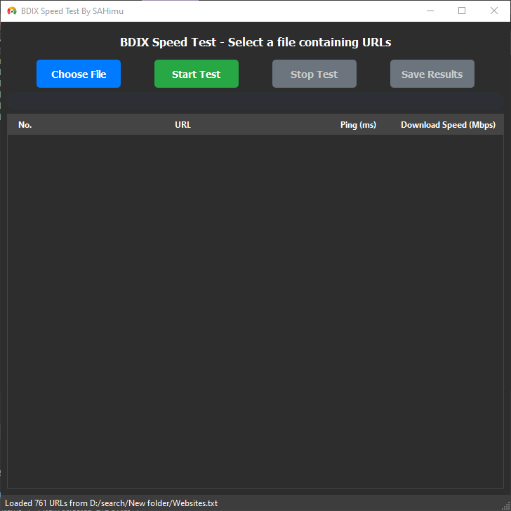
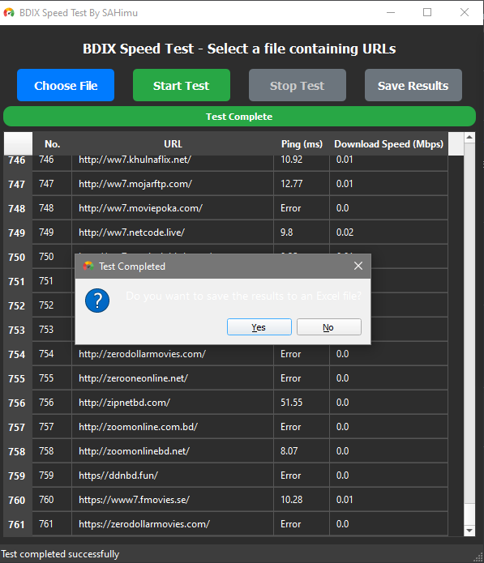

# BDIX Speed Test Application

A Python-based GUI application for testing network speeds (ping and download) for multiple URLs, specifically designed for BDIX (Bangladesh Internet Exchange) network testing.

   

---

## Features

- 📊 Test ping and download speeds for multiple URLs  
- 📁 Load URLs from text files  
- 💾 Save results to Excel format  
- 🎨 User-friendly PyQt5 interface  
- 📝 Comprehensive error logging  
- ⏯️ Start/Stop testing functionality  
- 🌐 Direct URL opening from results  
- 🎯 Color-coded results based on performance  
- 📈 Real-time progress tracking  

---

## Screenshot

  

*Application interface with dark theme and results table*

---

## Requirements

### System Requirements

- Windows 7, 8, 10, or 11  
- Python 3.7 or newer  
- 4GB RAM (recommended)  
- 500MB free storage space  
- Internet connection  

### Python Dependencies

- `requests >= 2.28.0`  
- `ping3 >= 4.0.0`  
- `PyQt5 >= 5.15.0`  
- `openpyxl >= 3.0.0`
- `qtawesome`
- `Qt`
  
---

## Installation

### Method 1: Manual Installation

1. Install Python (if not already installed)  
   - Download from [python.org](https://www.python.org/)  
   - During installation, check **Add Python to PATH**  

2. Download the application  
   - Download the ZIP file from GitHub and extract it  
   - Or clone the repository:
     ```bash
     git clone https://github.com/SAHimu369/bdix_website_test
     cd bdix-website-test
     ```

3. Install required packages:
    ```bash
    pip install -r requirements.txt
    ```
   Or individually:
    ```bash
    pip install requests ping3 PyQt5 openpyxl
    ```

### Method 2: Using the Installer Script (Windows)

1. Download the application files  
2. Double-click `install_requirements.bat` to install dependencies  
3. Double-click `Run Speed Test.bat` to launch the application  

---

## Usage

### Running the Application

- Using Python:
    ```bash
    python bdix_speed_test.py
    ```
- Using the batch file (Windows):
    - Double-click `Run Speed Test.bat`  

### Preparing URL Files

- Create a text file with URLs to test (one URL per line):
    ```text
    http://example.com/file1.zip
    http://example.com/file2.zip
    https://example.com/file3.zip
    ```

### Application Workflow

1. Click **Choose File** to select your URL list  
2. Click **Start Test** to begin testing  
3. Monitor progress in the progress bar  
4. View results in the table:
5. Save results to Excel using **Save Results** button  
6. Click on any URL to open it in your browser  
7. Use **Stop Test** to cancel ongoing testing  

---

## Building an Executable

To create a standalone executable (no Python installation required):

1. Install PyInstaller:
    ```bash
    pip install pyinstaller
    ```
2. Build the executable:
    ```bash
    pyinstaller --onefile --windowed --name "BDIX Speed Test" bdix_speed_test.py
    ```
3. The executable will be in the `dist` folder  

---

## File Structure

```text
bdix-speed-test/
├── bdix_speed_test.py         # Main application file
├── requirements.txt           # Python dependencies
├── install_requirements.bat   # Windows installer script
├── Run Speed Test.bat         # Windows launcher
├── icon.png                   # Application icon (optional)
├── speed_test.log             # Log file (generated at runtime)
└── README.md                  # This file
